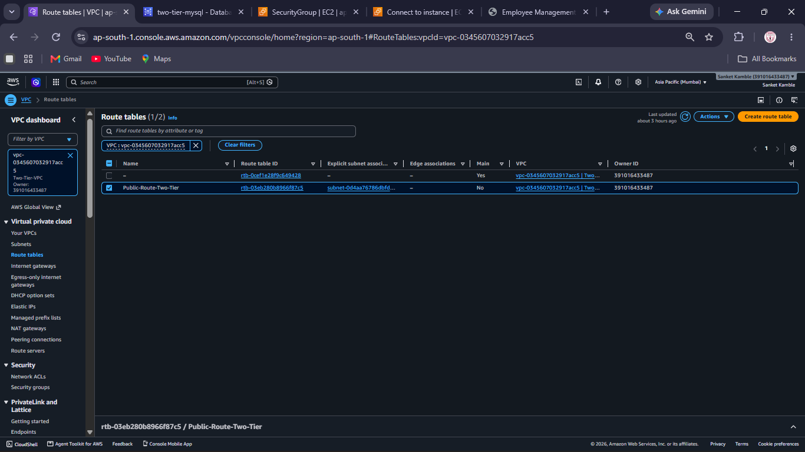
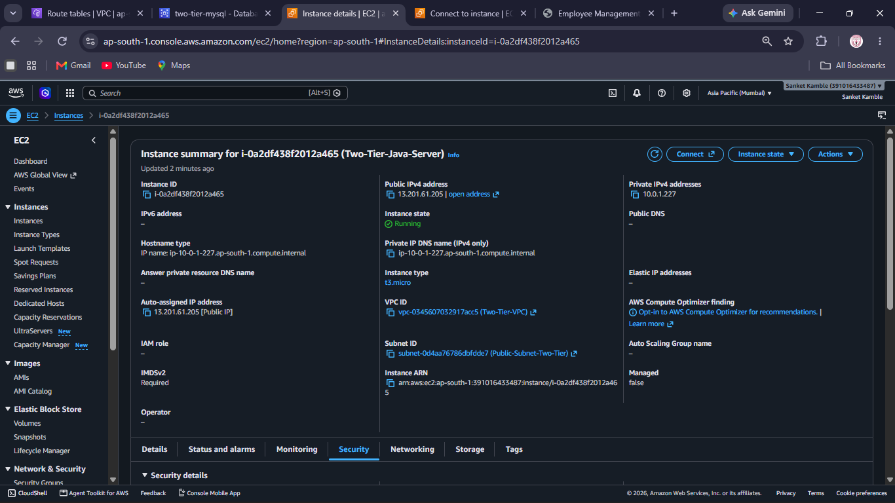
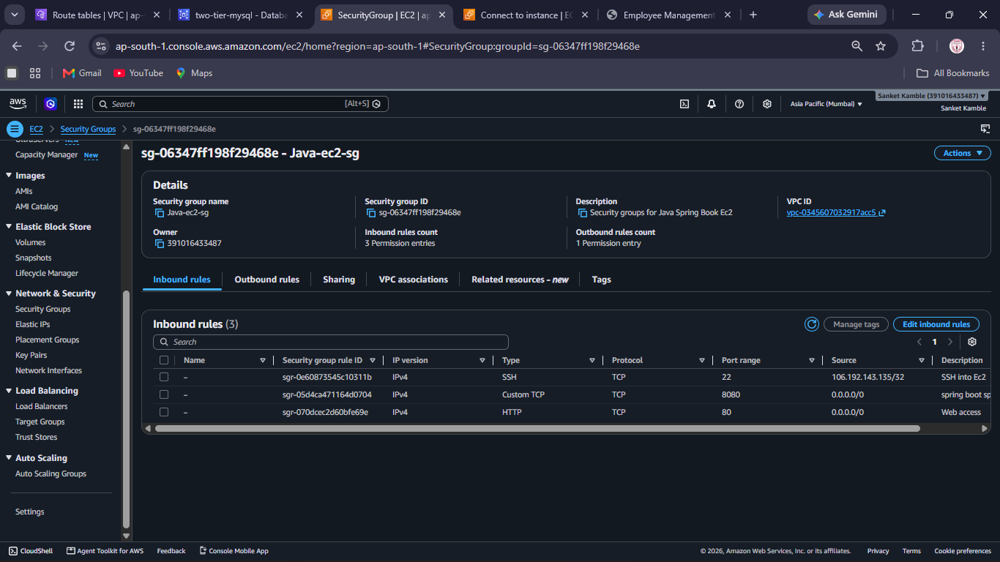
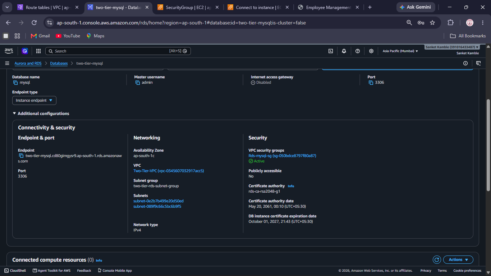
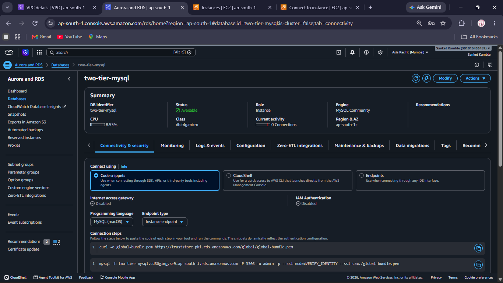
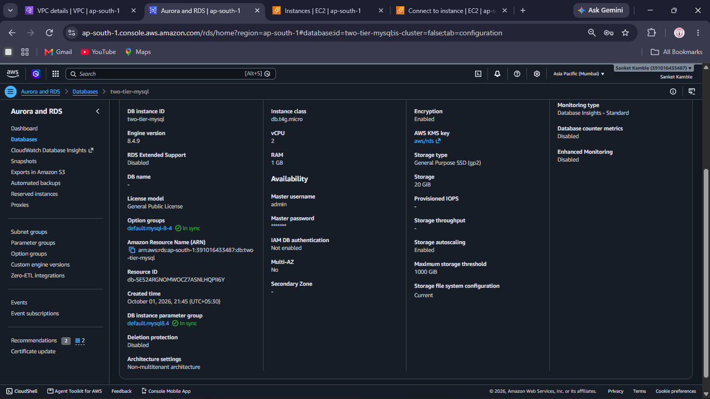
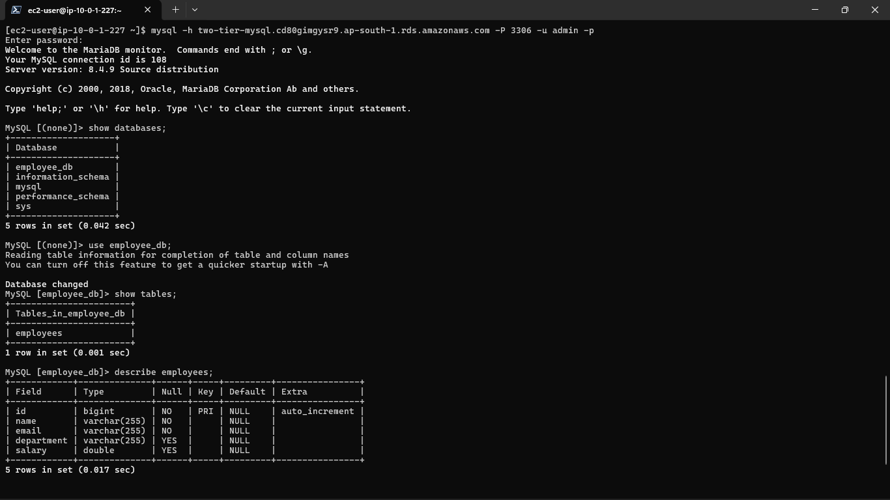
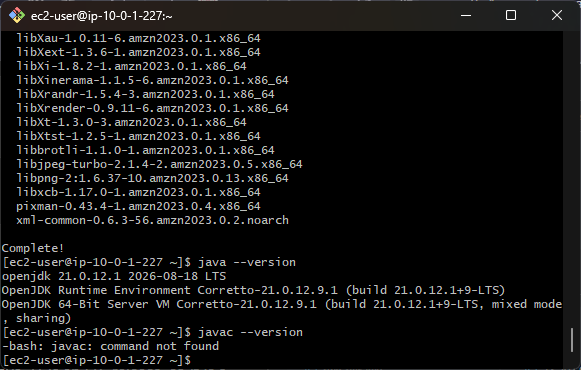
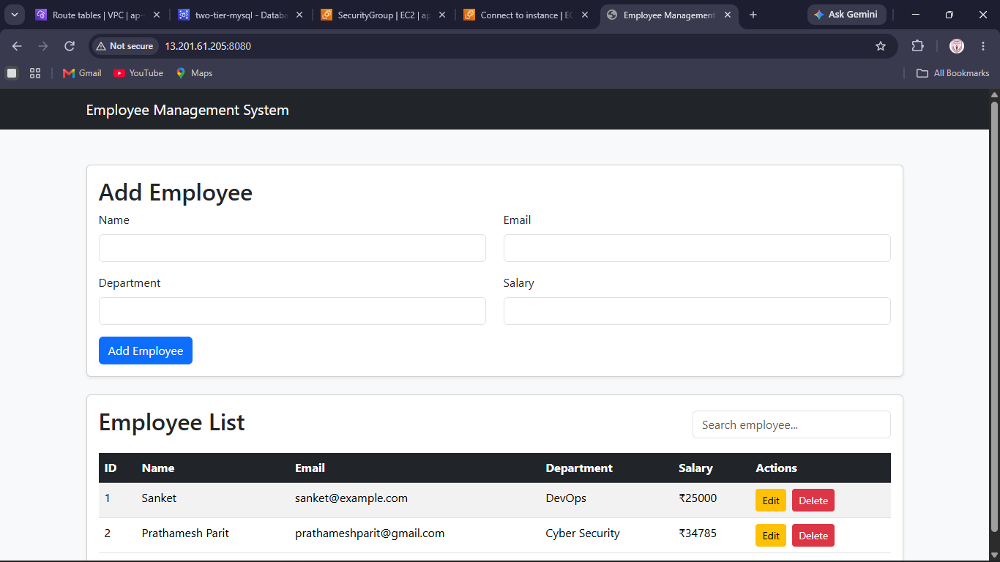
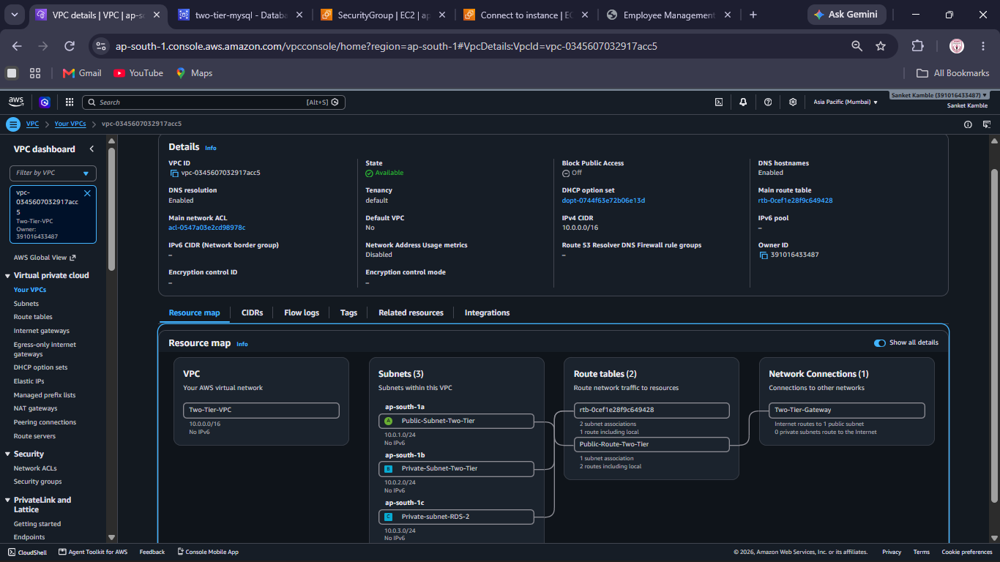

# AWS Two-Tier Employee Management Application

## AWS Project Assignment – Set 6 – Question 1

A two-tier **Employee Management System** deployed on AWS using **Amazon EC2** for the application tier and **Amazon RDS MySQL** for the database tier.

The application is built with **Java 21, Spring Boot, Maven, Thymeleaf, Bootstrap, JavaScript and MySQL**.

---

## 1. Project Objective

This project demonstrates a secure two-tier AWS architecture with:

- Amazon VPC
- Public and private subnets
- Internet Gateway
- Route tables
- Amazon EC2 application server
- Amazon RDS MySQL database
- Security Groups
- Private database connectivity
- Java Spring Boot Employee Management application
- CRUD operations for employee records

---

## 2. AWS Region

```text
Region: Asia Pacific (Mumbai)
Region Code: ap-south-1
```

---

## 3. Architecture

```text
                           INTERNET
                               |
                               v
                       Internet Gateway
                               |
                    +---------------------+
                    |     Two-Tier-VPC    |
                    |     10.0.0.0/16     |
                    |                     |
                    |   PUBLIC SUBNET     |
                    |    10.0.1.0/24      |
                    |         |           |
                    |         v           |
                    |      Amazon EC2      |
                    |  Java Spring Boot    |
                    |         |            |
                    +---------|------------+
                              |
                          TCP 3306
                              |
                              v
                    +---------------------+
                    |   PRIVATE SUBNETS   |
                    |    10.0.2.0/24      |
                    |    10.0.3.0/24      |
                    |         |           |
                    |         v           |
                    |   Amazon RDS MySQL   |
                    +---------------------+
```

### Traffic Flow

```text
Internet
   ↓
Internet Gateway
   ↓
Public Subnet
   ↓
EC2 / Spring Boot
   ↓
Private VPC Network
   ↓
RDS MySQL
```

The database tier is **not publicly accessible**.

---

## 4. VPC Configuration

```text
VPC Name: Two-Tier-VPC
CIDR: 10.0.0.0/16
VPC ID: vpc-0345607032917acc5
Region: ap-south-1
Internet Gateway: Two-Tier-Gateway
```

---

## 5. Subnet Configuration

| Subnet | CIDR | Availability Zone | Purpose |
|---|---|---|---|
| Public-Subnet-Two-Tier | 10.0.1.0/24 | ap-south-1a | EC2 application |
| Private-Subnet-Two-Tier | 10.0.2.0/24 | ap-south-1b | RDS subnet group |
| Private-subnet-RDS-2 | 10.0.3.0/24 | ap-south-1c | RDS subnet group |

---

## 6. Internet Gateway

```text
Name: Two-Tier-Gateway
```

The Internet Gateway is attached to `Two-Tier-VPC` and provides Internet connectivity for the public subnet.

The private database subnets do not use a direct Internet Gateway route.

---

## 7. Route Tables

### Public Route Table

```text
Name: Public-Route-Two-Tier
```

Routes:

```text
10.0.0.0/16 → local
0.0.0.0/0   → Internet Gateway
```

The public subnet is associated with the public route table.

### Private Routing

The private database subnets use private routing and do not have a direct `0.0.0.0/0` route to the Internet Gateway.



---

## 8. Amazon EC2

The Java Spring Boot application runs on Amazon EC2.

```text
Instance Name: Two-Tier-Java-Server
Instance Type: t3.micro
Operating System: Amazon Linux 2023
Private IP: 10.0.1.227
Subnet: Public-Subnet-Two-Tier
VPC: Two-Tier-VPC
IMDSv2: Required
Application Port: 8080
```

Application URL format:

```text
http://<EC2-PUBLIC-IP>:8080
```



---

## 9. EC2 Security Group

```text
Security Group: Java-ec2-sg
```

Inbound rules:

| Type | Port | Source | Purpose |
|---|---:|---|---|
| SSH | 22 | Administrator IP /32 | EC2 administration |
| Custom TCP | 8080 | 0.0.0.0/0 | Spring Boot application |
| HTTP | 80 | 0.0.0.0/0 | Web access |

SSH access is restricted to the administrator's IP address.



---

## 10. Amazon RDS MySQL

The database tier uses Amazon RDS.

```text
DB Identifier: two-tier-mysql
Engine: MySQL Community
Engine Version: 8.4.9
Instance Class: db.t4g.micro
Storage: 20 GiB
Storage Type: General Purpose SSD (gp2)
Encryption: Enabled
Multi-AZ: No
Publicly Accessible: No
Port: 3306
Availability Zone: ap-south-1c
```



---

## 11. RDS Networking

```text
VPC: Two-Tier-VPC
VPC ID: vpc-0345607032917acc5
DB Subnet Group: two-tier-rds-subnet-group
Network Type: IPv4
```

Private subnets:

```text
10.0.2.0/24
10.0.3.0/24
```

RDS endpoint:

```text
two-tier-mysql.cd80gimgysr9.ap-south-1.rds.amazonaws.com
```

MySQL port:

```text
3306
```





---

## 12. RDS Security

The RDS instance is configured as:

```text
Publicly Accessible: No
```

MySQL uses TCP port `3306`.

Database access should be restricted to the EC2 application Security Group and must not be opened to the public Internet.

---

## 13. DNS and Connectivity Test

The RDS endpoint was tested from the EC2 instance using:

```bash
nslookup two-tier-mysql.cd80gimgysr9.ap-south-1.rds.amazonaws.com
```

The endpoint resolved to a private VPC address.


---

## 14. MySQL Connectivity Test

The RDS database was accessed from EC2 using:

```bash
mysql -h two-tier-mysql.cd80gimgysr9.ap-south-1.rds.amazonaws.com -P 3306 -u admin -p
```

The MySQL client successfully connected to the RDS MySQL server.



---

## 15. Database

Database:

```text
employee_db
```

Table:

```text
employees
```

Verification commands:

```sql
SHOW DATABASES;
USE employee_db;
SHOW TABLES;
DESCRIBE employees;
```

The deployed table contains employee information including:

| Column | Purpose |
|---|---|
| id | Primary key |
| name | Employee name |
| email | Employee email |
| department | Employee department |
| salary | Employee salary |


---

## 16. Java Environment

Java was verified on EC2:

```text
Java: 21
Amazon Corretto: 21.0.12.1 LTS
```

Maven is used as the Java build tool.

Build command:

```bash
mvn clean package -DskipTests
```



---

## 17. Operating System

The EC2 instance runs:

```text
Amazon Linux 2023
```


---

## 18. Technology Stack

### Backend

- Java 21
- Spring Boot
- Spring Web
- Spring Data JPA
- Hibernate
- Maven

### Frontend

- HTML
- CSS
- Bootstrap
- JavaScript
- Thymeleaf

### Database

- Amazon RDS
- MySQL 8.4.9

### AWS

- Amazon VPC
- Amazon EC2
- Amazon RDS
- Internet Gateway
- Route Tables
- Security Groups

---

## 19. Application Features

- Add Employee
- View Employee List
- Edit Employee
- Delete Employee
- Search Employee
- REST API
- MySQL database persistence



---

## 20. REST API

### Get all employees

```http
GET /api/employees
```

Example:

```bash
curl http://localhost:8080/api/employees
```

### Get employee by ID

```http
GET /api/employees/{id}
```

### Add employee

```http
POST /api/employees
```

Example:

```bash
curl -X POST http://localhost:8080/api/employees \
-H "Content-Type: application/json" \
-d '{"name":"Sanket","email":"sanket@example.com","department":"DevOps","salary":25000}'
```

### Update employee

```http
PUT /api/employees/{id}
```

### Delete employee

```http
DELETE /api/employees/{id}
```

---

## 21. Project Structure

```text
employee-management/
│
├── pom.xml
│
├── src/
│   └── main/
│       ├── java/
│       │   └── com/example/employee/
│       │       ├── EmployeeManagementApplication.java
│       │       ├── Employee.java
│       │       ├── EmployeeRepository.java
│       │       ├── EmployeeController.java
│       │       └── WebController.java
│       │
│       └── resources/
│           ├── application.properties
│           ├── templates/
│           │   └── index.html
│           └── static/
│
└── README.md
```

---

## 22. Spring Boot Database Configuration

Example:

```properties
spring.application.name=employee-management

spring.datasource.url=jdbc:mysql://two-tier-mysql.cd80gimgysr9.ap-south-1.rds.amazonaws.com:3306/employee_db
spring.datasource.username=admin
spring.datasource.password=${DB_PASSWORD}
spring.datasource.driver-class-name=com.mysql.cj.jdbc.Driver

spring.jpa.hibernate.ddl-auto=update
spring.jpa.show-sql=true
spring.jpa.properties.hibernate.dialect=org.hibernate.dialect.MySQLDialect

server.port=8080
```

The actual database password is intentionally excluded.

---

## 23. Running the Application

From the project directory:

```bash
cd ~/employee-management
```

Build:

```bash
mvn clean package -DskipTests
```

Run:

```bash
java -jar target/employee-management-0.0.1-SNAPSHOT.jar
```

For background execution:

```bash
nohup java -jar target/employee-management-0.0.1-SNAPSHOT.jar > app.log 2>&1 &
```

Check port 8080:

```bash
ss -lntp | grep 8080
```

---

## 24. Testing Results

### EC2 Application Test

The Spring Boot application was successfully started on EC2 and accessed through a web browser.

### RDS DNS Test

The RDS endpoint was successfully resolved from EC2 using `nslookup`.

### RDS MySQL Test

The MySQL client successfully connected from EC2 to RDS over port 3306.

### Database Test

The `employee_db` database and `employees` table were successfully verified.

### Application Test

Employee records were successfully displayed in the web application.

### CRUD Test

The application implements Create, Read, Update, Delete and Search operations.

---

## 25. Security Design

### Application Tier

```text
Internet
   ↓
Internet Gateway
   ↓
Public Subnet
   ↓
EC2 / Spring Boot
```

### Database Tier

```text
EC2
   ↓
Private VPC Network
   ↓
RDS MySQL
```

The RDS database is not publicly accessible.

The intended security flow is:

```text
Internet → EC2 → RDS
```

rather than:

```text
Internet → RDS
```

---

## 26. VPC Resource Map



The resource map shows the VPC, public subnet, private subnets, route tables and Internet Gateway.

---

## 27. Evidence File List

The README expects the following screenshot files in the same repository directory:

| File | Evidence |
|---|---|
| `finalvpc.png` | VPC Resource Map |
| `route.png` | Route Tables |
| `ec2img.png` | EC2 Instance |
| `ec2sg.png` | EC2 Security Group |
| `rdsimg.png` | RDS Instance |
| `db1.png` | RDS Details |
| `db2.png` | RDS Configuration |
| `mysql.png` | MySQL / Database |
| `java.png` | Java Environment |
| `os.png` | Amazon Linux |
| `browser.png` | Application UI |
| `cmd.png` | EC2 Commands / Connectivity |

---

## 28. Deployment Process

```text
1. Create VPC
        ↓
2. Create public and private subnets
        ↓
3. Create Internet Gateway
        ↓
4. Configure route tables
        ↓
5. Create EC2 Security Group
        ↓
6. Launch EC2 in public subnet
        ↓
7. Create RDS Security Group
        ↓
8. Create RDS DB subnet group
        ↓
9. Launch MySQL RDS
        ↓
10. Test EC2 → RDS connectivity
        ↓
11. Install Java 21
        ↓
12. Install Maven
        ↓
13. Deploy Spring Boot application
        ↓
14. Configure RDS connection
        ↓
15. Start application on port 8080
        ↓
16. Test Employee CRUD operations
```

---

## 29. Security Best Practices

Never commit secrets to GitHub.

Use:

```properties
spring.datasource.password=${DB_PASSWORD}
```

and provide the password through an environment variable:

```bash
export DB_PASSWORD='YOUR_RDS_PASSWORD'
```

Do not upload:

```text
*.pem
.env
private keys
database passwords
API tokens
```

For production deployments, AWS Secrets Manager can be used for database credentials.

---

## 30. Final Result

The AWS two-tier Employee Management application was successfully deployed.

```text
                 INTERNET
                     |
                     v
              Internet Gateway
                     |
                     v
             PUBLIC SUBNET
              10.0.1.0/24
                     |
                     v
              EC2 / Java App
                     |
                     | TCP 3306
                     v
             PRIVATE SUBNETS
          10.0.2.0/24
          10.0.3.0/24
                     |
                     v
              AMAZON RDS
               MYSQL 8.4.9
```

The application successfully connects to the RDS database and provides Employee Management functionality through the Spring Boot web application.

---

## Author

**Sanket Kamble**

```text
Java | Spring Boot | AWS | EC2 | RDS | MySQL | VPC | Maven
```
